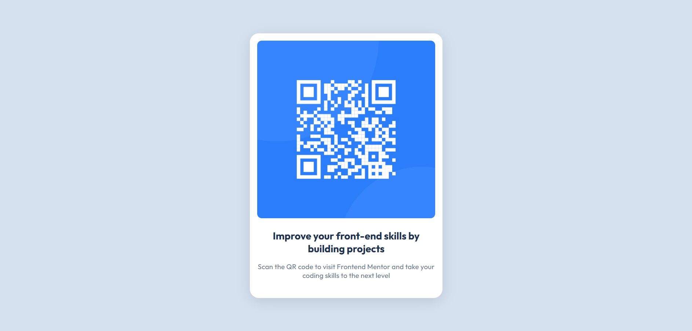

# Frontend Mentor - QR code component solution

This is a solution to the [QR code component challenge on Frontend Mentor](https://www.frontendmentor.io/challenges/qr-code-component-iux_sIO_H). Frontend Mentor challenges help you improve your coding skills by building realistic projects. 

## Table of contents

- [Overview](#overview)
  - [Screenshot](#screenshot)
  - [Links](#links)
- [My process](#my-process)
  - [Built with](#built-with)
  - [What I learned](#what-i-learned)
  - [Continued development](#continued-development)
- [Author](#author)

**Note: Delete this note and update the table of contents based on what sections you keep.**

## Overview

### Screenshot

### Links

- Solution URL: [Add solution URL here](https://your-solution-url.com)
- Live Site URL: [Add live site URL here](https://your-live-site-url.com)

## My process

### Built with

- Semantic HTML5 markup
- CSS custom properties
- Flexbox
- Mobile-first workflow

### What I learned

I learned on using the article instead of making the main section as the card itself. Also, in my previous work, to round the edges of the square, i need to do it on the image and its wrapper. But i realized its repetitive and i can just use overflow: hidden to hid the overlaps. I am starting to get comfortable with using flexbox. Before, i cannot even imagine where to start or how to approach it. Thanks the flexbox froggy. 

### Continued development

I want to be comfortable with using overflow, determining the width, and maximizing semantic elements and accessbility.

### Useful resources

## Author

- Website - [Bill Jerson](https://www.your-site.com)
- Frontend Mentor - [@bjax20](https://www.frontendmentor.io/profile/bjax20)

